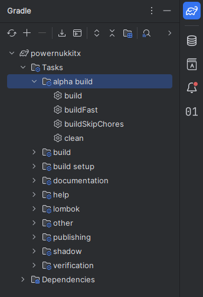
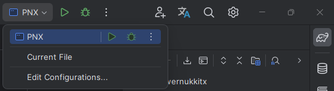

# Contributing to PowerNukkitX

Thanks for taking the time to contribute. Bug fixes, features, and documentation improvements are all welcome.

**Before you open a PR, read [Pull Requests](#-pull-requests) and [AI Tool Usage](#-ai-tool-usage).** Those two sections describe the things that get PRs closed.

**Found a security vulnerability?** Do **not** open a public issue - see [SECURITY.md](SECURITY.md).

---

## 🌱 New to Open Source?

- [Finding ways to contribute on GitHub](https://docs.github.com/en/get-started/exploring-projects-on-github/finding-ways-to-contribute-to-open-source-on-github)
- [Setting up Git](https://docs.github.com/en/get-started/getting-started-with-git/set-up-git)
- [Understanding GitHub flow](https://docs.github.com/en/get-started/using-github/github-flow)
- [Collaborating with pull requests](https://docs.github.com/en/github/collaborating-with-pull-requests)

Read the [README](README.md) first for an overview of the project.

---

## 📋 Issues

### Reporting a bug

[Search existing issues](https://github.com/PowerNukkitX/PowerNukkitX/issues) first - yours may already be tracked or fixed. If not, open one with the [issue form](https://github.com/PowerNukkitX/PowerNukkitX/issues/new/choose) and include:

- Server version (the commit hash from `/version`) and Java version
- Bedrock client version
- Exact steps to reproduce
- Expected vs. actual behaviour
- Relevant plugins and config, plus the full stack trace if there is one

Reproduce on a **vanilla PNX server with no plugins** if you can. If the bug only happens with a plugin loaded, say so explicitly.

> Issues are not a support channel. For help, questions, or discussion, use the [Discord server](https://discord.com/invite/powernukkitx-944227466912870410).

### Working on an issue

We don't pre-assign issues. Pick one and open a PR. For anything large or architectural, comment on the issue first so we can agree on the approach before you write the code - this avoids wasted work on both sides.

---

## 🔧 Making Changes

1. **Fork** and clone your fork.
   - [Fork with IntelliJ IDEA](https://www.jetbrains.com/help/idea/fork-github-projects.html#fork) · [Clone from GitHub](https://www.jetbrains.com/help/idea/manage-projects-hosted-on-github.html#clone-from-GitHub)
2. Install **JDK 21**.
3. Branch off `master` and make your changes.
4. Build with the Gradle tasks:

   | Task              | Purpose                                                |
   |-------------------|--------------------------------------------------------|
   | `buildSkipChores` | First full build                                       |
   | `buildFast`       | Incremental rebuild                                    |
   | `shadowJar`       | Produce a distributable `powernukkitx.jar` in `build/` |
   | `clean`           | Wipe the build folder                                  |
   | `test`            | Run the unit tests                                     |

   

5. **Start the server and test your change in-game** before opening a PR.

   

---

## 🎨 Code Quality & Style

- Match the **existing style** of the file you're editing. When in doubt, copy the surrounding code.
- **One logical change per PR.** Split unrelated fixes into separate PRs - they get reviewed and merged faster.
- **No unrelated churn**: no drive-by reformatting, whitespace fixes, import reordering, or refactors outside your scope. A 40-line fix buried in a 2000-line reformat will be closed.
- **Javadoc every public API** you add or change.
- **No dead code**, commented-out blocks, `System.out.println`, or leftover debug logging.
- **Don't break the public API** without discussing it first. Deprecate rather than delete where possible, and mention the break in your PR description.
- **New dependencies need justification.** Open an issue before adding one.
- Add **unit tests** for logic that can be tested headlessly (`src/test/java`).
- If the change is performance-sensitive, include **benchmark numbers or profiling notes** in the PR.
- **Commit messages** follow [Conventional Commits](https://www.conventionalcommits.org/): `fix: prevent crash when chunk loads before world init`, `feat: add /debug genrate command`, `chore(deps): bump netty`.

---

## 📬 Pull Requests

- Fill in the **PR template** completely. Sections left as unedited placeholders are treated as not filled in.
- [Link the issue](https://docs.github.com/en/issues/tracking-your-work-with-issues/linking-a-pull-request-to-an-issue) with `Closes #123` / `Fixes #123`.
- Enable **"Allow maintainer edits"**.
- Open a **draft PR** if the work isn't finished. Don't mark it ready for review until you've built and tested it.
- **Every PR must be tested by a human on a running server.** Describe exactly what you tested and how - "tested" alone is not a test report. This is not negotiable.
- Reply to review feedback and [resolve conversations](https://docs.github.com/en/github/collaborating-with-pull-requests/commenting-on-a-pull-request#resolving-conversations) once addressed. Push follow-up commits rather than force-pushing while a review is in flight - we squash on merge, so a messy branch history costs you nothing.
- Hit merge conflicts? This [tutorial](https://github.com/skills/resolve-merge-conflicts) walks through them.
- Stale PRs with unanswered review feedback may be closed after 30 days. Reopening later is fine.

### PRs we close without review

To keep review time available for real contributions, the following are closed on sight, with a link to this section and no line-by-line review:

- **Obvious slop** - machine-generated code the author clearly did not read, verify, or run.
- **Code that doesn't compile**, or that fails CI on the first push with no follow-up.
- **Untested changes**, or a PR whose testing section is empty, generic, or fabricated.
- **Hallucinated APIs** - calls to methods, fields, config keys, or events that do not exist in this codebase.
- **Mass rewrites**: repo-wide reformats, blanket "optimizations", or refactors nobody asked for.
- **AI-written PR descriptions or review replies** (see below).
- **Undisclosed AI usage**, or an AI disclosure that is obviously incomplete.
- **Duplicate or spam PRs**, including hacktoberfest-style filler.

If your PR is closed under this section, you're welcome to fix the underlying problems and open a new one. Repeated offences lead to a block.

Once merged, your contributions will be publicly visible in the project. You're officially a PowerNukkitX contributor! 🎉

---

## 🤖 AI Tool Usage

AI tooling is allowed. Hiding it, or shipping its output unread, is not.

> If you use a coding agent, point it at [AGENTS.md](AGENTS.md) first. It documents the build commands, the repo layout, and the rules agents break most often. It won't excuse you from anything below, but it will stop your PR failing on avoidable mistakes.

### 1. Disclose per agent, per task

A generic "I used AI" is no longer sufficient. Every PR that used AI in any capacity must state **which model did which part of the work**. Name the specific model and version, not the vendor or product family.

Put this table in your PR description:

| Model                          | What it did                                           |
|--------------------------------|-------------------------------------------------------|
| Claude Opus 5                  | Wrote the unit tests in `EntityFallingBlockTest`      |
| GPT-4o                         | Drafted Javadoc for the new public methods            |

Rules for the table:

- "Claude", "ChatGPT", "an LLM", or "AI" alone is **not** a model name. `Claude Opus 5`, `GPT-4o`, `Gemini 2.5 Pro` are.
- If you don't know which model your IDE assistant used, say so and name the tool and its default.
- Autonomous agents that edited files across the repo must be listed as such, with the scope of what they touched.
- Include AI use for *anything* in the PR: code, tests, Javadoc, commit messages, config, or research into how a subsystem works.
- If no AI was involved, write "No AI used." Say it explicitly.

If it comes out later that AI was used and not disclosed, the PR is closed and the omission is treated as a trust problem, not a paperwork slip.

### 2. Write your own prose

**No LLM-generated text in issues, PR descriptions, review replies, or discussions.** Your own words - imperfect English included - are worth more to us than a polished generated paragraph. Spell checkers and translators are fine; if you translate, include the original language below the English.

If you can't explain your change in your own words, it isn't ready.

### 3. Own the output

You are the author of everything in your PR, whoever typed it. You must be able to explain any line a maintainer asks about, and you must have read every line yourself before pushing. "The model wrote it" is not an answer to a review comment.

### 4. No AI-generated media

No AI-generated images, icons, audio, or video. A rough human sketch beats a generated asset every time. ❤️

### 5. No AI-only bug reports

Don't open issues from a model's claim that code is buggy. Reproduce it on a real server first.

Repeated misuse - undisclosed AI, untested generated code, hallucinated APIs - results in closed PRs and eventually a loss of contribution access.

---

## ⚖️ Licensing & Copyright

- Contributions are licensed under **LGPL-3.0**, the same licence as PowerNukkitX.
- Do not copy code from incompatibly-licensed projects without permission and attribution.
- If your contribution derives from another open-source project, name the source and its licence in the PR.
- AI-generated code can reproduce copyrighted material verbatim. Review it before you submit - you are responsible for what you contribute.

---

## 🤝 Community Conduct

- Be kind, patient, and constructive, especially with newcomers.
- **Critique code, not people.**
- Maintainers have the final say on what fits the project's direction. A closed PR is not a personal rejection.
- Harassment, discrimination, or hostility of any kind may result in a permanent ban. See the [Code of Conduct](CODE_OF_CONDUCT.md).

---

Large codebases are daunting. If you're stuck or unsure where to start, ask on [Discord](https://discord.com/invite/powernukkitx-944227466912870410) - we're glad to point you in the right direction. Happy contributing! 🚀

---

> **AI disclosure for this document**, per our own rules: written by a human, with drafting and editing help from [Claude Sonnet 4.5](https://claude.ai) and [Claude Opus 5](https://claude.ai). All policy decisions in it are the maintainers'.
