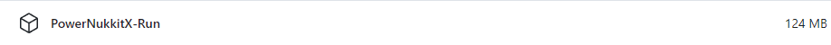

<h1 align="center">Welcome to PowerNukkitX 👋</h1>
<p>
  
  <a href="https://jitpack.io/#PowerNukkitX/PowerNukkitX" target="_blank">
    
  </a>
  <a href="https://github.com/PowerNukkitX/PowerNukkitX/actions?query=branch%3Amaster+is%3Asuccess" target="_blank">
    
  </a>
  <a href="https://app.codecov.io/github/PowerNukkitX/PowerNukkitX" target="_blank">
    
  </a>
  <a href="https://pnx-wiki.pages.dev" target="_blank">
    
  </a>
  <a href="https://www.gnu.org/licenses/lgpl-3.0.html" target="_blank">
    
  </a>
  <a href="https://discord.com/invite/XXus4FB6qf">
    
  </a>
</p>

> Feature-rich, highly customizable third-party server software for Minecraft: Bedrock Edition.  
> - Custom Item,Block,Entity
> - Built-in AI framework
> - Terra Generator
> - Full Vanilla Command Support
> - More features to discover...

### 🏠 [Homepage](https://v2.powernukkitx.com/)

## Install
1. Make sure you have `JDK21` installed and environment variables set, if not [download from](https://www.graalvm.org/downloads)
2. [Select the version you want to use](https://github.com/PowerNukkitX/PowerNukkitX/actions?query=branch%3Amaster+is%3Asuccess)
3. Make sure you have a github account, login it, if not [sign up](https://docs.github.com/en/get-started/start-your-journey/creating-an-account-on-github)!
4. Click to the version you want to use and scroll down to find artifacts.
5. Download the `PowerNukkitX-Run.zip`  
[](https://github.com/PowerNukkitX/PowerNukkitX/actions?query=branch%3Amaster+is%3Asuccess)
6. Unzip `PowerNukkitX-Run.zip` to the directory you want.

## Usage
```sh
java -jar cli.jar
```

## Author

👤 **PowerNukkitX Team**

## 🤝 Contributing

Contributions, issues and feature requests are welcome!<br />Feel free to
check [issues page](https://github.com/PowerNukkitX/PowerNukkitX/issues). You can also take a look at
the [contributing guide](.github/CONTRIBUTING.md).

## Show your support

Give a ⭐️ if this project helped you!  

### Donate
- [Patreon](https://www.patreon.com/coolloong)
- Ethereum: 0x140fc5f4c1fb00270c3491275d316470abc887f0
## 📝 License

This project is [LGPL-3](https://www.gnu.org/licenses/lgpl-3.0.html) licensed.

***
_This README was generated with ❤️ by [readme-md-generator](https://github.com/kefranabg/readme-md-generator)_
