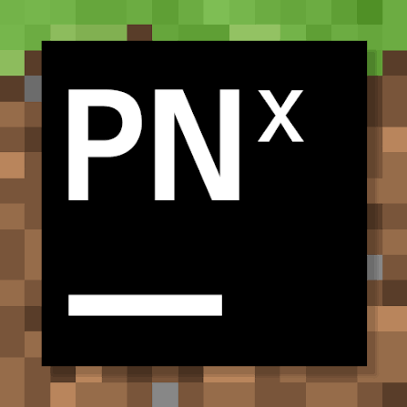

[](https://powernukkitx.org)

**A Minecraft Bedrock Edition Server Software, open source and written in java**


[-56383E)](https://www.minecraft.net/en-us/article/minecraft-26-30-bedrock-changelog)
[](https://github.com/Mojang/bedrock-protocol-docs)
[](https://github.com/PowerNukkitX/PowerNukkitX/actions?query=branch%3Amaster+is%3Asuccess)
[](https://discord.com/invite/XXus4FB6qf)
[](https://docs.powernukkitx.org)
[](https://codecov.io/github/PowerNukkitX/PowerNukkitX)
[](https://www.gnu.org/licenses/lgpl-3.0.html)

**Feature-rich, highly customizable third-party server software for Minecraft: Bedrock Edition.**

- 🪄 **Custom Item, Block and Entity support**
- 🤖 **Vanilla-like Mob AI**
- 🪴 **Terra Generator**
- ✏️ **Full Vanilla Command Support**
- 🗃️ **Full Item, Block and Container Support**
- 🗿 **More features to discover...**

## Install

1. Make sure you have `JDK21` installed, if not [download from here](https://www.graalvm.org/downloads)
2. Download the [`powernukkitx.jar`](https://github.com/PowerNukkitX/PowerNukkitX/releases/download/snapshot/powernukkitx.jar)
3. Get your start script [here](https://github.com/PowerNukkitX/scripts/tree/master)

## Usage

Starting PowerNukkitX

```sh
java -jar --add-opens java.base/java.lang=ALL-UNNAMED --add-opens java.base/java.io=ALL-UNNAMED .\powernukkitx.jar
```

If you use a newer java version (greater than 21) you have to use one of the [startup scripts.](https://github.com/PowerNukkitX/scripts/tree/master)

## Community & Support

Join our [Discord](https://discord.gg/apwd7uauZg) server to chat with other users and developers.

## 🤝 Contributing to PowerNukkitX

Contributions, issues and feature requests are welcome!
Feel free to
check [issues page](https://github.com/PowerNukkitX/PowerNukkitX/issues). You can also take a look at
the [contributing guide](.github/CONTRIBUTING.md).

[](https://github.com/PowerNukkitX/PowerNukkitX/graphs/contributors)

## Give a ⭐️ if this project helped you

[](https://starchart.cc/PowerNukkitX/PowerNukkitX)

## 📝 License Information

This project is licensed under LGPL-3.0. Please see the [LICENSE](/LICENSE) file for details.
